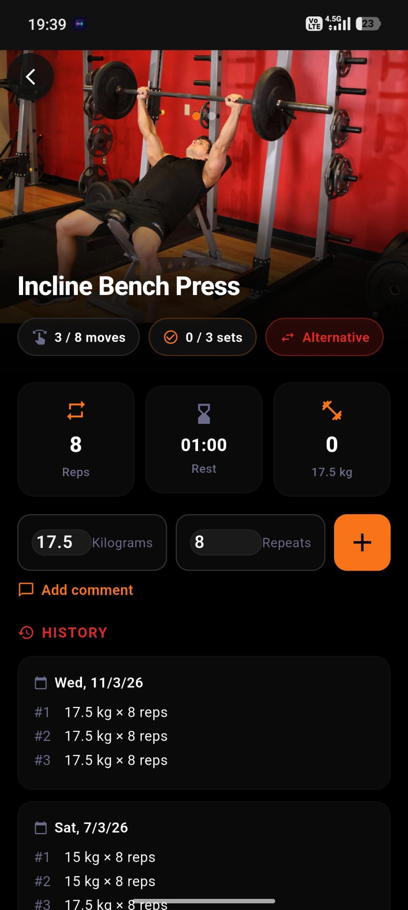
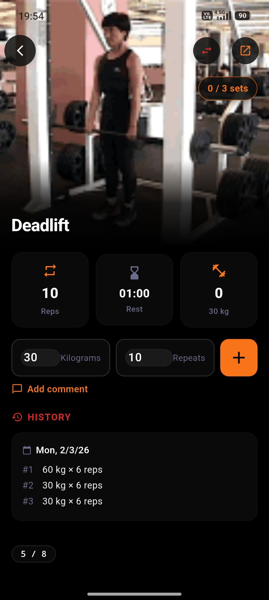
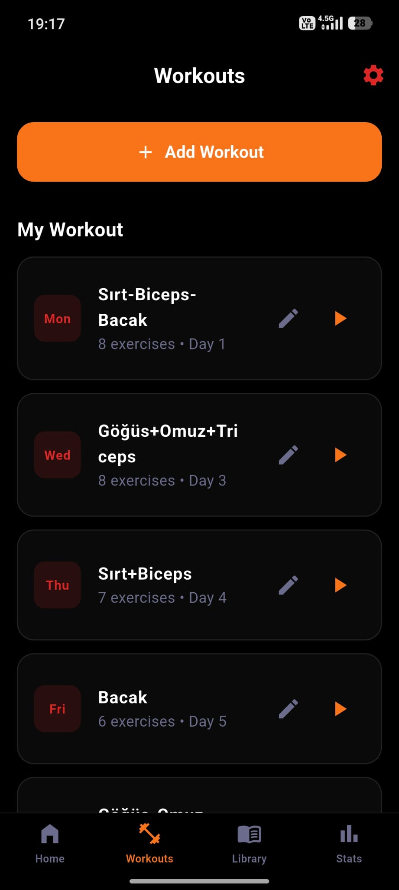
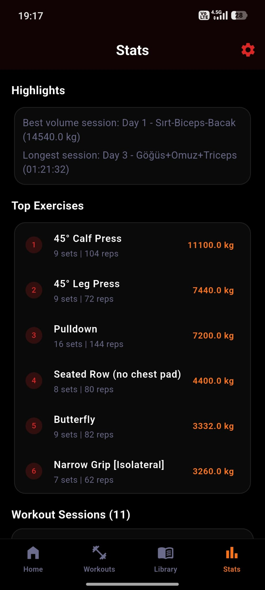

<div align="center">
  
  <h1>Modern Workout Tracker</h1>
  <p>A sleek fitness tracking application built with Flutter — supports Light, Dark &amp; Pure Black (AMOLED) themes.</p>
  <p>
    
    
    
    
  </p>
</div>

## Features

- **Light / Dark / Pure Black Themes:** Full theme support with 6 color palettes (Default, Ocean, Sunset, Forest, Rose, Crimson) and AMOLED-friendly pure black mode.
- **Exercise Library:** 873 exercises categorized by muscle groups with auto-cycling image demonstrations (public domain, [free-exercise-db](https://github.com/yuhonas/free-exercise-db)).
- **Smart Tracking:** Log sets, reps, and weights during active workout sessions with swipeable exercise navigation and built-in rest timer.
- **Cardio Support:** Dedicated cardio timer for exercises like Cycle Ergometer, Treadmill, etc.
- **Workout Plans & Routines:** Create custom routines, assign them to specific days, and follow structured training programs.
- **Workout Schedule:** Calendar-based weekly schedule with configurable workout days and auto-positioning.
- **Workout Summary:** Post-workout summary screen showing calories burned, total time, and total volume.
- **Body Progress Charts:** Track body measurements (weight, arm, waist, chest, etc.) with line charts over time.
- **Muscle Group Distribution:** Donut chart showing muscle group workout distribution with period filters.
- **Weekly Insights:** Beautifully animated vertical bar charts showing weekly Volume, Reps, and Sets data.
- **Calories Chart:** Track calories burned over time with line chart visualization.
- **Stats Dashboard:** Overview cards for total workouts, volume, duration, and sets with session-level breakdown.
- **Settings & Profile:** Configure theme, color palette, background mode, language, weight unit (kg/lbs), height, and body measurements.
- **Multi-Language Support:** English, Turkish (Türkçe), and Spanish (Español) localization built-in.
- **First Day of Week Setting:** Choose Monday, Saturday, or Sunday as your week start — workout plans sort accordingly.
- **Add Exercise from Library:** Long-press or tap "Add to Workout" from any exercise detail to add it to a workout plan.
- **Redesigned Exercise Detail Screen:** Hero images with SliverAppBar, auto-cycling GIF-like animation, card-based metrics, modern history cards.
- **Backup & Restore:** Export/import your workout data for safe keeping.
- **Cross-Platform:** Runs seamlessly on Android and Windows Desktop.

## Screenshots

<p align="center">
  
  
  
</p>
<p align="center">
  
  
  
</p>
<p align="center">
  
  
  
</p>

## Download & Install

You can easily install and test the app on your Android device!

1. Go to the **[Releases](https://github.com/serdevir91/Workout-Tracker/releases)** section of this repository.
2. Download the latest `app-release.apk` file.
3. Transfer the file to your Android phone.
4. Open the file manager, tap on the APK, and select **Install** (You may need to allow "Install from unknown sources" in your settings).

### Windows

Download and run the Windows build from the [Releases](https://github.com/serdevir91/Workout-Tracker/releases) page, or build it yourself with:

```bash
flutter build windows
```

## Tech Stack

| Component | Technology |
|-----------|-----------|
| **Framework** | [Flutter](https://flutter.dev/) 3.41 (Dart 3.11) |
| **Local Database** | sqflite (SQLite) |
| **State Management** | Provider |
| **UI Components** | TableCalendar, Custom IndexedStack Navigation |
| **Localization** | Custom translation system (EN / TR / ES) |

## Project Structure

```
lib/
|-- main.dart                  # App entry point
|-- db/                        # Database helper (SQLite)
|-- l10n/                      # Translations (EN, TR)
|-- models/                    # Data models (Workout, Plan, etc.)
|-- providers/                 # State management (Workout, Settings)
|-- screens/                   # All app screens
|   |-- home_screen.dart
|   |-- active_workout_screen.dart
|   |-- exercise_library_screen.dart
|   |-- exercise_info_screen.dart
|   |-- plans_screen.dart
|   |-- create_routine_screen.dart
|   |-- stats_screen.dart
|   |-- settings_screen.dart
|   |-- workout_detail_screen.dart
|   |-- workout_schedule_screen.dart
|   |-- workout_summary_screen.dart
|   `-- swipeable_exercise_screen.dart
|-- services/                  # Notification service
|-- utils/                     # Utility functions
`-- widgets/                   # Reusable widgets
```

## Run Locally

```bash
# Clone the repository
git clone https://github.com/serdevir91/Workout-Tracker.git

# Navigate to the project folder
cd Workout-Tracker

# Install dependencies
flutter pub get

# Run on Android
flutter run

# Build release APK
flutter build apk --release

# Build for Windows
flutter build windows
```

## What's New (v3.1.5)

- **Cardio Issue Fixed** — Cardio exercises now handle timer/session flow more reliably during active workouts.
- **Session Completion Reliability** — Workout session finishing logic was improved to reduce incomplete or inconsistent summaries.
- **Stats & Summary Consistency** — Stats and workout summary calculations were aligned with the updated workout/session flow.

<details>
<summary>v3.0.1 Changes</summary>

- **Refined Muscle Group Categories** — Split broad groups into specific targets: Arms → Biceps + Triceps, Legs → Quadriceps + Hamstrings, Glutes & Hips → Glutes, added Lower Back as separate category, Traps moved to Shoulders
- **Exercise Timer Fix** — Timer now correctly tracks the currently viewed exercise instead of always the last one; background time compensation also uses the active exercise
- **All Exercises Properly Finished** — Workout completion now finishes all open exercises (not just the last one), fixing duration tracking for multi-exercise workouts
- **Smart Muscle Group Matching** — Added 60+ custom exercise name overrides, fuzzy keyword matching with caching, and special bench press detection (close-grip → Triceps, others → Chest)
- **Improved Donut Chart** — Muscle group distribution chart is now properly centered with centered legend layout
- **Exercise Library Updates** — Category list updated to match new fine-grained muscle groups with distinct colors and icons

</details>

<details>
<summary>v3.0.0 Changes</summary>

- **Free Exercise Database** — Replaced ExRx.net with [free-exercise-db](https://github.com/yuhonas/free-exercise-db) (873 exercises, public domain / Unlicense)
- **Auto-Cycling Exercise Images** — Exercise detail screen images now auto-cycle between start/end positions like a GIF animation (1.2s interval)
- **Improved Image Quality** — High-resolution JPG images for all exercises, served from GitHub CDN
- **Exercise Add Bug Fixed** — Adding exercises to workouts from the library now works correctly in all views
- **Removed url_launcher Dependency** — Streamlined dependencies, no more external browser launches for exercises
- **Cleaned Up Codebase** — Removed 24+ legacy Python scraping scripts and outdated data files

</details>

<details>
<summary>v2.2.1 Changes</summary>

- **Redesigned Exercise Detail Screen** — Hero GIF with SliverAppBar, card-based metrics, modern history cards with LIVE badge
- **First Day of Week Setting** — Choose Monday, Saturday, or Sunday; workout plans sort accordingly
- **Add Exercise from Library** — Tap "Add to Workout" from exercise detail to add it to any workout plan
- **Exercise Counter Repositioned** — Swipe indicator (1/8) now sits right below the sets counter badge
- **Workout Plan Sorting** — Next training cards respect first day of week setting
- **Alternative Exercise Swap** — Quick swap button in exercise detail AppBar

</details>

<details>
<summary>v2.1.0 Changes</summary>

- **Light / Dark / Pure Black themes** with full theme-aware colors across all screens
- **6 Color Palettes:** Default, Ocean, Sunset, Forest, Rose, Crimson
- **Pure Black (AMOLED) mode** for battery saving on OLED screens
- **Spanish language** support added
- **Swipeable exercise navigation** during active workouts
- **Body progress charts** with 10 measurement types
- **Muscle group donut chart** with period filters
- **Calories burned chart** with time-based tracking
- **Cardio exercise support** with dedicated timer
- **Backup & Restore** functionality
- **Improved date formatting** in workout history and detail screens
- Workout Plans & Routines with day assignment
- Workout Schedule with calendar view
- Post-workout Summary screen
- Settings screen (Theme, Color Palette, Background Mode, Language, Units, Profile)
- Exercise thumbnails in workout lists
- Windows desktop support improvements

</details>

<details>
<summary>v2.0.0 Changes</summary>

- **Exercise library overhaul** — 526+ exercises with GIF demonstrations
- **Workout Plans & Routines** — Create custom routines and assign to specific days
- **Workout Schedule** — Calendar-based weekly schedule with configurable workout days
- **Post-workout Summary** — Calories burned, total time, and total volume overview
- **Stats Dashboard** — Total workouts, volume, duration, and sets with session breakdown
- **Body Progress Charts** — Track weight, arm, waist, chest and more with line charts
- **Multi-Language Support** — English and Turkish localization
- **Settings & Profile** — Theme, language, weight unit (kg/lbs), height, body measurements
- **Notification Service** — Rest timer and workout reminder notifications
- **Improved data models** — Pydantic-style validation for workout data

</details>

<details>
<summary>v1.0.0 Initial Release</summary>

- Core workout tracking with sets, reps, and weight logging
- Exercise library with 526+ exercises and GIF demonstrations
- Active workout session with rest timer
- Workout history and detail screens
- SQLite local database storage
- Dark theme support
- Android and Windows platform support

</details>

---
