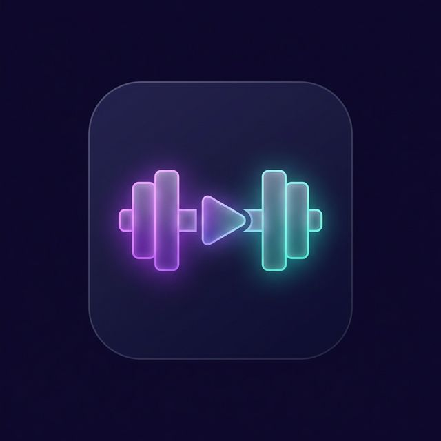
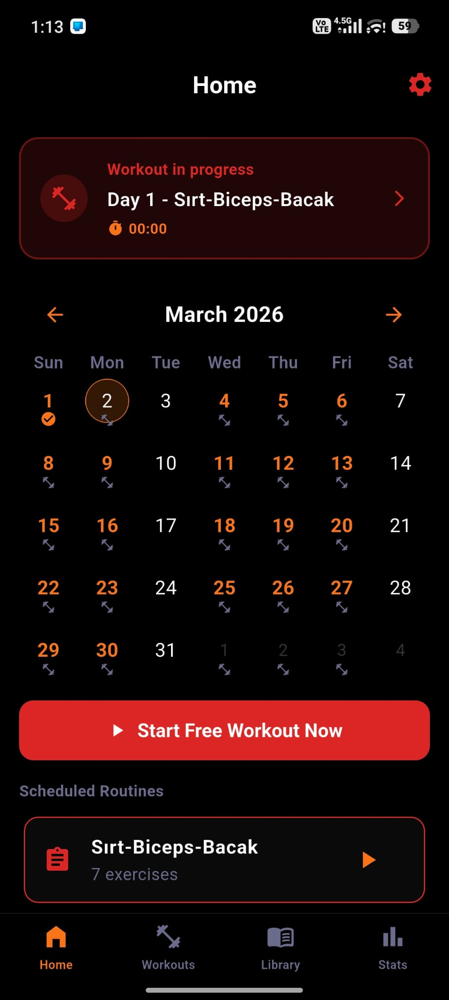
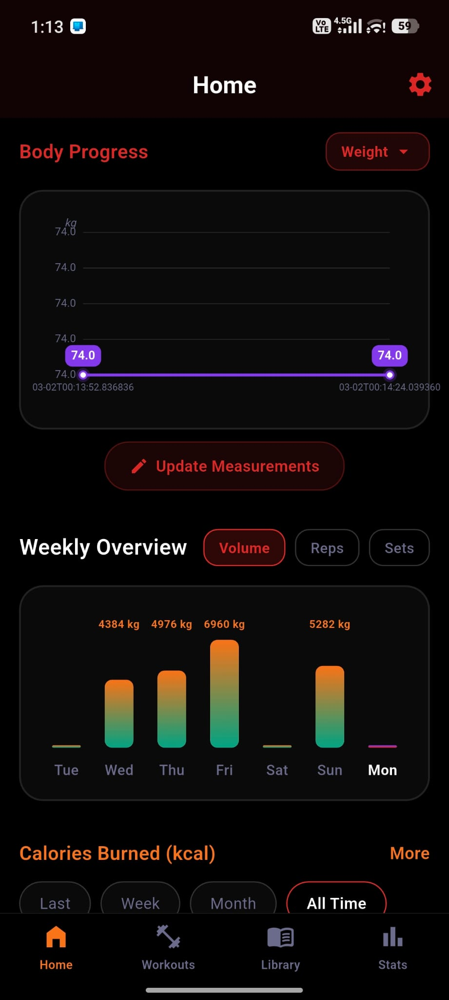
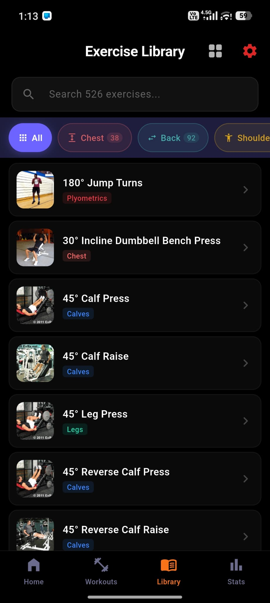
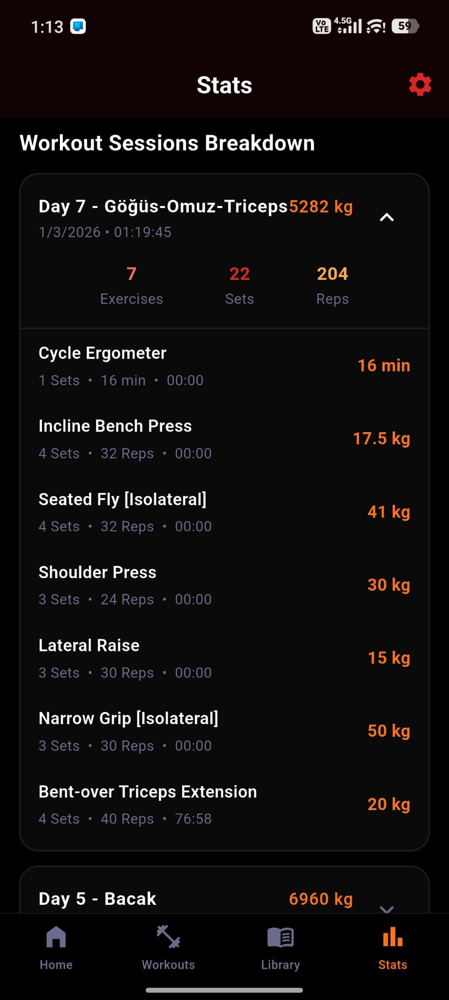
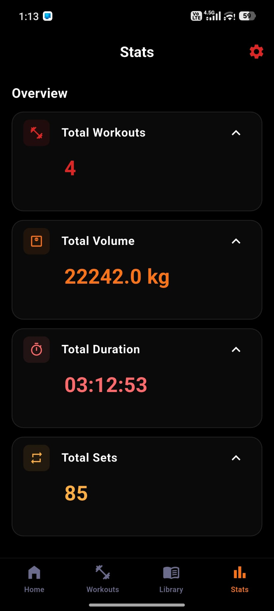

<div align="center">
  
  <h1>Modern Workout Tracker</h1>
  <p>A sleek fitness tracking application built with Flutter — supports Light, Dark &amp; Pure Black (AMOLED) themes.</p>
  <p>
    
    
    
    
  </p>
</div>

## ✨ Features

- **Light / Dark / Pure Black Themes:** Full theme support with 6 color palettes (Default, Ocean, Sunset, Forest, Rose, Crimson) and AMOLED-friendly pure black mode.
- **Exercise Library:** 526+ exercises categorized by muscle groups with GIF demonstrations sourced from ExRx.net.
- **Smart Tracking:** Log sets, reps, and weights during active workout sessions with swipeable exercise navigation and built-in rest timer.
- **Cardio Support:** Dedicated cardio timer for exercises like Cycle Ergometer, Treadmill, etc.
- **Workout Plans & Routines:** Create custom routines, assign them to specific days, and follow structured training programs.
- **Workout Schedule:** Calendar-based weekly schedule with configurable workout days and auto-positioning.
- **Workout Summary:** Post-workout summary screen showing calories burned, total time, and total volume.
- **Body Progress Charts:** Track body measurements (weight, arm, waist, chest, etc.) with line charts over time.
- **Muscle Group Distribution:** Donut chart showing muscle group workout distribution with period filters.
- **Weekly Insights:** Beautifully animated vertical bar charts showing weekly Volume, Reps, and Sets data.
- **Calories Chart:** Track calories burned over time with line chart visualization.
- **Stats Dashboard:** Overview cards for total workouts, volume, duration, and sets with session-level breakdown.
- **Settings & Profile:** Configure theme, color palette, background mode, language, weight unit (kg/lbs), height, and body measurements.
- **Multi-Language Support:** English, Turkish (Türkçe), and Spanish (Español) localization built-in.
- **Backup & Restore:** Export/import your workout data for safe keeping.
- **Cross-Platform:** Runs seamlessly on Android and Windows Desktop.

## 📱 Screenshots

<p align="center">
  
  
  
</p>
<p align="center">
  
  
  
</p>

## 🚀 Download & Install

You can easily install and test the app on your Android device!

1. Go to the **[Releases](https://github.com/serdevir91/Workout-Tracker/releases)** section of this repository.
2. Download the latest `app-release.apk` file.
3. Transfer the file to your Android phone.
4. Open the file manager, tap on the APK, and select **Install** (You may need to allow "Install from unknown sources" in your settings).

### Windows

Download and run the Windows build from the [Releases](https://github.com/serdevir91/Workout-Tracker/releases) page, or build it yourself with:

```bash
flutter build windows
```

## 💻 Tech Stack

| Component | Technology |
|-----------|-----------|
| **Framework** | [Flutter](https://flutter.dev/) 3.41 (Dart 3.11) |
| **Local Database** | sqflite (SQLite) |
| **State Management** | Provider |
| **UI Components** | TableCalendar, Custom IndexedStack Navigation |
| **Localization** | Custom translation system (EN / TR / ES) |

## 📁 Project Structure

```
lib/
├── main.dart                  # App entry point
├── db/                        # Database helper (SQLite)
├── l10n/                      # Translations (EN, TR)
├── models/                    # Data models (Workout, Plan, etc.)
├── providers/                 # State management (Workout, Settings)
├── screens/                   # All app screens
│   ├── home_screen.dart
│   ├── active_workout_screen.dart
│   ├── exercise_library_screen.dart
│   ├── exercise_info_screen.dart
│   ├── plans_screen.dart
│   ├── create_routine_screen.dart
│   ├── stats_screen.dart
│   ├── settings_screen.dart
│   ├── workout_detail_screen.dart
│   ├── workout_schedule_screen.dart
│   ├── workout_summary_screen.dart
│   └── swipeable_exercise_screen.dart
├── services/                  # Notification service
├── utils/                     # Utility functions
└── widgets/                   # Reusable widgets
```

## 🛠️ Run Locally

```bash
# Clone the repository
git clone https://github.com/serdevir91/Workout-Tracker.git

# Navigate to the project folder
cd Workout-Tracker

# Install dependencies
flutter pub get

# Run on Android
flutter run

# Build release APK
flutter build apk --release

# Build for Windows
flutter build windows
```

## 📋 What's New (v2.1)

- **Light / Dark / Pure Black themes** with full theme-aware colors across all screens
- **6 Color Palettes:** Default, Ocean, Sunset, Forest, Rose, Crimson
- **Pure Black (AMOLED) mode** for battery saving on OLED screens
- **Spanish language** support added
- **Swipeable exercise navigation** during active workouts
- **Body progress charts** with 10 measurement types
- **Muscle group donut chart** with period filters
- **Calories burned chart** with time-based tracking
- **Cardio exercise support** with dedicated timer
- **Backup & Restore** functionality
- **Improved date formatting** in workout history and detail screens
- Workout Plans & Routines with day assignment
- Workout Schedule with calendar view
- Post-workout Summary screen
- Settings screen (Theme, Color Palette, Background Mode, Language, Units, Profile)
- Exercise thumbnails in workout lists
- Improved ExRx exercise matching
- Windows desktop support improvements

---
*Built with ❤️ for fitness enthusiasts.*
