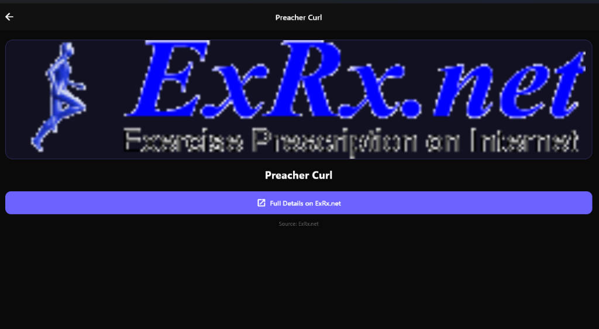
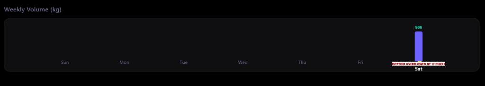
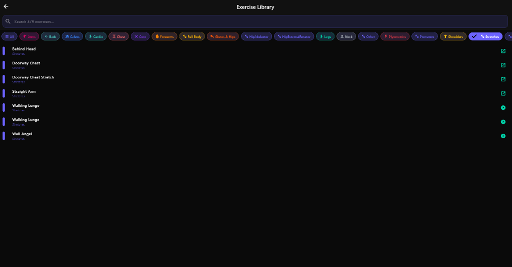
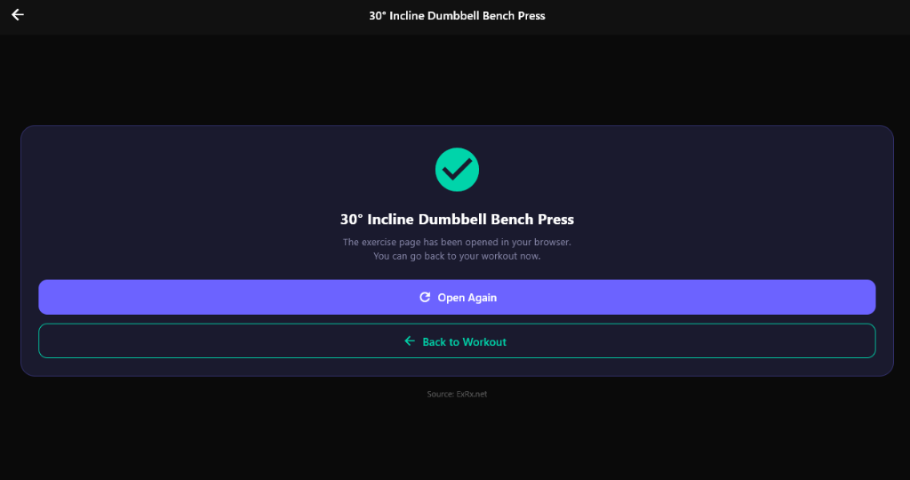

<div align="center">
  
  <h1>Modern Workout Tracker</h1>
  <p>A sleek, dark-themed fitness tracking application built with Flutter.</p>
</div>

## ✨ Features

- **Dark & Glassmorphism UI:** Premium, modern interface with vibrant neon accents (Purple & Mint Green).
- **Exercise Library:** Comprehensive list of exercises categorized by muscle groups with GIF demonstrations.
- **Smart Tracking:** Log your sets, reps, and weights during active workout sessions.
- **Weekly Insights:** Beautifully animated vertical bar charts showing weekly Volume, Reps, and Sets data.
- **Cross-Platform:** Runs seamlessly on Android and Windows Desktop.

## 📱 Screenshots

<div align="center">
  
  
</div>
<br>
<div align="center">
  
  
</div>

*(Note: Please ensure the screenshots you uploaded are placed inside the `assets/screenshots/` folder named `1.png`, `2.png`, `3.png`, and `4.png` respectively).*

## 🚀 Download & Install

You can easily install and test the app on your Android device!

1. Download the latest APK file directly from this repository:
   👉 **[Download app-release.apk](assets/app-release.apk)**
2. Transfer the file to your Android phone.
3. Open the file manager, tap on the APK, and select **Install** (You may need to allow "Install from unknown sources" in your settings).

## 💻 Tech Stack

- **Framework:** [Flutter](https://flutter.dev/) (Dart)
- **Local Database:** sqflite (SQLite)
- **State Management:** Provider
- **UI Components:** TableCalendar, Custom IndexedStack Navigation

## 🛠️ Run Locally

If you want to run or build the project yourself:

```bash
# Clone the repository
git clone https://github.com/serdevir91/serde.git

# Navigate to the project folder
cd Code/Workout-Tracker

# Install dependencies
flutter pub get

# Run on your connected device (Windows Desktop or Android Emulator)
flutter run
```

---
*Built with ❤️ for fitness enthusiasts.*
